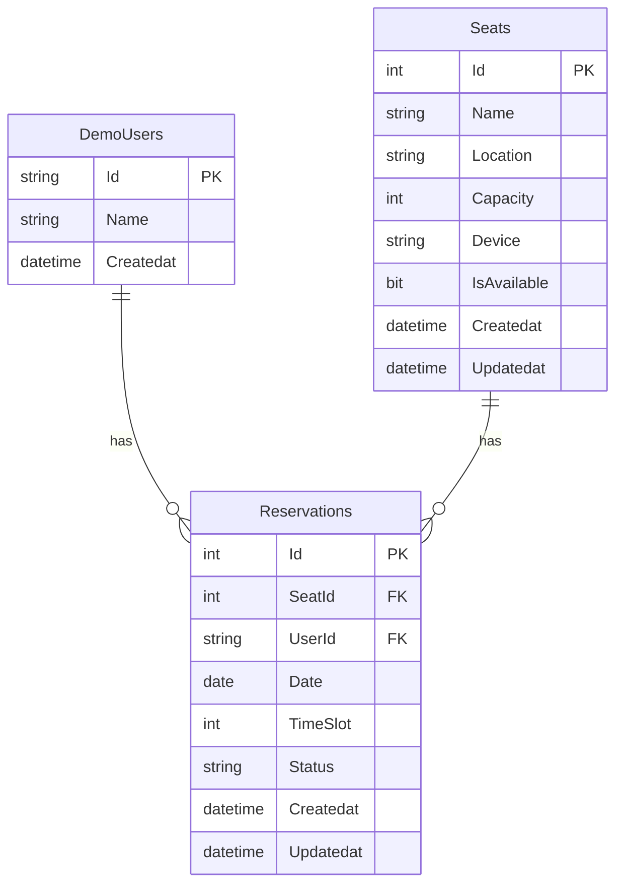

# 数据库设计：图书馆座位预约系统

---

## 1. 数据设计目标

| 目标 | 说明 |
|------|------|
| 支撑业务闭环 | 座位管理、预约提交、预约取消、管理端查询 |
| 数据一致性 | 同一座位同一日期同一时段不能被重复有效预约 |
| 查询效率 | 支撑管理端按日期、状态、区域、用户筛选 |
| 简洁可控 | 3 张核心表，不过度设计，适合课堂项目 |

---

## 2. 核心实体清单

| 实体 | 对应表 | 说明 | 来源 |
|------|--------|------|------|
| 座位 | Seats | 图书馆座位基础信息 | PRD-Lite §11.1 |
| 预约 | Reservations | 用户预约记录 | PRD-Lite §11.2 |
| 体验账号 | DemoUsers | 3 个预设体验账号 | PRD-Lite §11.4 |
| 管理员 | - | 硬编码在代码中，不入库 | PRD-Lite §11.3 |

> 说明：管理员账号密码（admin/123456）硬编码在 `AdminAuthService` 中，不存储在数据库。

---

## 3. 关系说明

### 3.1 实体关系图（文字版）

```
┌─────────────────┐       ┌─────────────────────┐
│    DemoUsers     │       │       Seats          │
│─────────────────│       │─────────────────────│
│ PK: Id (string) │       │ PK: Id (int)        │
│    Name          │       │    Name             │
└────────┬────────┘       │    Location         │
         │                │    Capacity         │
         │                │    Device           │
         │                │    IsAvailable      │
         │                └────────┬────────────┘
         │                         │
         │    ┌────────────────────┘
         │    │
         ▼    ▼
┌─────────────────────────┐
│      Reservations        │
│─────────────────────────│
│ PK: Id (int)            │
│ FK: SeatId → Seats.Id   │
│ FK: UserId → DemoUsers.Id│
│    Date                  │
│    TimeSlot              │
│    Status                │
│    CreatedAt             │
└─────────────────────────┘
```

### 3.2 关系说明

| 关系 | 类型 | 说明 |
|------|------|------|
| Seats → Reservations | 一对多 | 一个座位可有多条预约记录 |
| DemoUsers → Reservations | 一对多 | 一个用户可有多条预约记录 |
| Reservations → Seats | 多对一 | 每条预约关联一个座位 |
| Reservations → DemoUsers | 多对一 | 每条预约关联一个用户 |

### 3.3 外键约束

| 外键字段 | 引用表 | 引用字段 | 删除规则 |
|----------|--------|----------|----------|
| Reservations.SeatId | Seats | Id | RESTRICT（有预约时不能删除座位） |
| Reservations.UserId | DemoUsers | Id | RESTRICT（有预约时不能删除用户） |

---

## 4. 表结构设计

### 4.1 Seats 表（座位）

| 字段名 | 数据类型 | 约束 | 默认值 | 说明 |
|--------|----------|------|--------|------|
| Id | int | PK, IDENTITY(1,1) | - | 主键，自增 |
| Name | nvarchar(50) | NOT NULL | - | 座位名称（如：A-01、B-02） |
| Location | nvarchar(100) | NOT NULL | - | 位置描述（如：一楼靠窗、二楼安静区） |
| Capacity | int | NOT NULL | 1 | 容量（通常为 1） |
| Device | nvarchar(200) | NULL | NULL | 设备信息（如：有电源、有台灯） |
| IsAvailable | bit | NOT NULL | 1 | 是否可预约（1=可用，0=不可用） |
| CreatedAt | datetime2 | NOT NULL | GETUTCDATE() | 创建时间 |
| UpdatedAt | datetime2 | NOT NULL | GETUTCDATE() | 最后更新时间 |

**建表 SQL：**

```sql
CREATE TABLE Seats (
    Id INT IDENTITY(1,1) PRIMARY KEY,
    Name NVARCHAR(50) NOT NULL,
    Location NVARCHAR(100) NOT NULL,
    Capacity INT NOT NULL DEFAULT 1,
    Device NVARCHAR(200) NULL,
    IsAvailable BIT NOT NULL DEFAULT 1,
    CreatedAt DATETIME2 NOT NULL DEFAULT GETUTCDATE(),
    UpdatedAt DATETIME2 NOT NULL DEFAULT GETUTCDATE()
);
```

**索引：**

```sql
-- 按位置查询座位
IX_Seats_Location ON Seats(Location);

-- 按可用状态筛选
IX_Seats_IsAvailable ON Seats(IsAvailable);
```

---

### 4.2 Reservations 表（预约）

| 字段名 | 数据类型 | 约束 | 默认值 | 说明 |
|--------|----------|------|--------|------|
| Id | int | PK, IDENTITY(1,1) | - | 主键，自增 |
| SeatId | int | FK → Seats.Id, NOT NULL | - | 关联座位 |
| UserId | nvarchar(50) | FK → DemoUsers.Id, NOT NULL | - | 关联用户 |
| Date | date | NOT NULL | - | 预约日期（如：2026-07-14） |
| TimeSlot | int | NOT NULL | - | 时段（8-20，对应 8:00-20:00） |
| Status | nvarchar(20) | NOT NULL | N'已预约' | 状态：已预约/已取消/已过时 |
| CreatedAt | datetime2 | NOT NULL | GETUTCDATE() | 创建时间 |
| UpdatedAt | datetime2 | NOT NULL | GETUTCDATE() | 最后更新时间 |

**建表 SQL：**

```sql
CREATE TABLE Reservations (
    Id INT IDENTITY(1,1) PRIMARY KEY,
    SeatId INT NOT NULL,
    UserId NVARCHAR(50) NOT NULL,
    Date DATE NOT NULL,
    TimeSlot INT NOT NULL,
    Status NVARCHAR(20) NOT NULL DEFAULT N'已预约',
    CreatedAt DATETIME2 NOT NULL DEFAULT GETUTCDATE(),
    UpdatedAt DATETIME2 NOT NULL DEFAULT GETUTCDATE(),
    
    CONSTRAINT FK_Reservations_Seats FOREIGN KEY (SeatId) REFERENCES Seats(Id),
    CONSTRAINT FK_Reservations_DemoUsers FOREIGN KEY (UserId) REFERENCES DemoUsers(Id),
    CONSTRAINT CK_Reservations_TimeSlot CHECK (TimeSlot >= 8 AND TimeSlot <= 20),
    CONSTRAINT CK_Reservations_Status CHECK (Status IN (N'已预约', N'已取消', N'已过时'))
);
```

**索引：**

```sql
-- 核心约束：同一座位同一日期同一时段不能有重复有效预约
IX_Reservations_SeatDateSlot ON Reservations(SeatId, Date, TimeSlot, Status);

-- 查询我的预约
IX_Reservations_UserId_Date ON Reservations(UserId, Date);

-- 管理端按日期查询
IX_Reservations_Date ON Reservations(Date);

-- 管理端按状态查询
IX_Reservations_Status ON Reservations(Status);
```

---

### 4.3 DemoUsers 表（体验账号）

| 字段名 | 数据类型 | 约束 | 默认值 | 说明 |
|--------|----------|------|--------|------|
| Id | nvarchar(50) | PK | - | 用户标识（如：user1、user2、user3） |
| Name | nvarchar(50) | NOT NULL | - | 显示名称（如：小王、小李、小张） |
| CreatedAt | datetime2 | NOT NULL | GETUTCDATE() | 创建时间 |

**建表 SQL：**

```sql
CREATE TABLE DemoUsers (
    Id NVARCHAR(50) PRIMARY KEY,
    Name NVARCHAR(50) NOT NULL,
    CreatedAt DATETIME2 NOT NULL DEFAULT GETUTCDATE()
);
```

**种子数据：**

```sql
INSERT INTO DemoUsers (Id, Name) VALUES
(N'user1', N'小王'),
(N'user2', N'小李'),
(N'user3', N'小张');
```

---

## 5. 关键字段说明

### 5.1 TimeSlot 字段

| 值 | 对应时间 | 说明 |
|----|----------|------|
| 8 | 8:00-9:00 | 上午第一个时段 |
| 9 | 9:00-10:00 | - |
| 10 | 10:00-11:00 | - |
| 11 | 11:00-12:00 | - |
| 12 | 12:00-13:00 | 午间时段 |
| 13 | 13:00-14:00 | - |
| 14 | 14:00-15:00 | - |
| 15 | 15:00-16:00 | - |
| 16 | 16:00-17:00 | - |
| 17 | 17:00-18:00 | - |
| 18 | 18:00-19:00 | - |
| 19 | 19:00-20:00 | - |
| 20 | 20:00-21:00 | 晚间最后一个时段 |

**共 13 个时段（8:00-21:00）**

### 5.2 Status 字段

| 状态值 | 说明 | 触发条件 |
|--------|------|----------|
| 已预约 | 有效预约 | 用户提交预约 |
| 已取消 | 用户主动取消 | 用户点击取消按钮 |
| 已过时 | 时间已过期 | 查询时动态判断（当前时间 > 时段结束时间） |

### 5.3 IsAvailable 字段

| 值 | 说明 |
|----|------|
| 1 (true) | 座位可被预约 |
| 0 (false) | 座位不可用（管理员设为不可用） |

> 说明：`IsAvailable` 是座位的全局状态，与具体时段无关。即使座位可用，特定时段也可能已被预约。

---

## 6. 状态字段设计

### 6.1 预约状态流转

```
[用户提交预约]
    ↓
  已预约
    ↓
    ├── 用户取消 → 已取消
    ↓
    └── 时间过期 → 已过时（查询时判断）
```

### 6.2 状态判断逻辑

| 场景 | 判断逻辑 | 代码示例 |
|------|----------|----------|
| 座位是否可预约 | `IsAvailable == true` 且该时段无有效预约 | `!seat.IsAvailable \|\| HasReservation(seatId, date, slot)` |
| 预约是否可取消 | `Status == "已预约"` 且当前时间 < 时段开始时间 | `reservation.Status == "已预约" && DateTime.Now < startTime` |
| 预约是否已过时 | `Status == "已预约"` 且当前时间 >= 时段结束时间 | `reservation.Status == "已预约" && DateTime.Now >= endTime` |

### 6.3 已过时状态的处理

**设计方案**：已过时状态不存储在数据库中，查询时动态判断。

```csharp
// 查询时计算状态
public string GetDisplayStatus(Reservation reservation)
{
    if (reservation.Status == "已取消")
        return "已取消";
    
    var endTime = reservation.Date.AddHours(reservation.TimeSlot + 1);
    if (DateTime.Now >= endTime)
        return "已过时";
    
    return "已预约";
}
```

**好处**：不需要定时任务更新状态，数据保持简洁。

---

## 7. 查询与筛选字段设计

### 7.1 用户端查询

| 页面 | 查询条件 | 返回字段 | SQL 示例 |
|------|----------|----------|----------|
| 座位列表 | 无 | Id, Name, Location, Device, IsAvailable | `SELECT * FROM Seats WHERE IsAvailable = 1` |
| 座位详情 | SeatId | 所有字段 | `SELECT * FROM Seats WHERE Id = @seatId` |
| 我的预约 | UserId | 预约列表 + 座位名称 | `SELECT r.*, s.Name FROM Reservations r JOIN Seats s ON r.SeatId = s.Id WHERE r.UserId = @userId` |
| 预约提交检查 | SeatId, Date, TimeSlot | 是否存在有效预约 | `SELECT COUNT(*) FROM Reservations WHERE SeatId = @seatId AND Date = @date AND TimeSlot = @slot AND Status = N'已预约'` |

### 7.2 管理端查询

| 页面 | 查询条件 | 返回字段 | SQL 示例 |
|------|----------|----------|----------|
| 预约管理 | Date, Status, UserId, SeatId | 预约列表 + 用户名 + 座位名 | 多条件动态查询 |
| 座位管理 | 无 | 所有座位字段 | `SELECT * FROM Seats` |
| 统计页 | Date（日期范围） | 预约总数、各座位使用次数 | 聚合查询 |

### 7.3 管理端筛选条件

```csharp
// 动态查询示例
public List<AdminBookingItem> GetBookings(DateTime? date, string status, string userId, int? seatId)
{
    var query = _dbContext.Reservations
        .Include(r => r.Seat)
        .Include(r => r.User)
        .AsQueryable();

    if (date.HasValue)
        query = query.Where(r => r.Date == date.Value);

    if (!string.IsNullOrEmpty(status))
        query = query.Where(r => r.Status == status);

    if (!string.IsNullOrEmpty(userId))
        query = query.Where(r => r.UserId == userId);

    if (seatId.HasValue)
        query = query.Where(r => r.SeatId == seatId.Value);

    return query.OrderByDescending(r => r.CreatedAt)
        .Select(r => new AdminBookingItem { ... })
        .ToList();
}
```

---

## 8. 统计字段与统计口径

### 8.1 统计指标

| 指标 | 计算方式 | 说明 |
|------|----------|------|
| 预约总数 | `COUNT(*) FROM Reservations WHERE Status != '已取消'` | 排除已取消的预约 |
| 今日预约数 | `COUNT(*) WHERE Date = TODAY AND Status != '已取消'` | 当天预约数 |
| 各座位使用次数 | `GROUP BY SeatId, COUNT(*)` | 按座位统计预约次数 |
| 座位使用率 | `使用次数 / 总时段数 × 100%` | 某时间段内座位被预约的比例 |
| 用户预约数 | `GROUP BY UserId, COUNT(*)` | 按用户统计预约次数 |

### 8.2 统计 SQL 示例

```sql
-- 预约总数（排除已取消）
SELECT COUNT(*) AS TotalReservations
FROM Reservations
WHERE Status != N'已取消';

-- 今日预约数
SELECT COUNT(*) AS TodayReservations
FROM Reservations
WHERE Date = CAST(GETUTCDATE() AS DATE)
  AND Status != N'已取消';

-- 各座位使用次数（本周）
SELECT 
    s.Name AS SeatName,
    s.Location,
    COUNT(r.Id) AS ReservationCount
FROM Seats s
LEFT JOIN Reservations r ON s.Id = r.SeatId
    AND r.Date >= DATEADD(DAY, -7, GETUTCDATE())
    AND r.Status != N'已取消'
GROUP BY s.Id, s.Name, s.Location
ORDER BY ReservationCount DESC;

-- 座位使用率（本周）
SELECT 
    s.Name AS SeatName,
    COUNT(r.Id) AS UsedSlots,
    13 * 7 AS TotalSlots,  -- 13个时段 × 7天
    CAST(COUNT(r.Id) AS FLOAT) / (13 * 7) * 100 AS UsageRate
FROM Seats s
LEFT JOIN Reservations r ON s.Id = r.SeatId
    AND r.Date >= DATEADD(DAY, -7, GETUTCDATE())
    AND r.Status != N'已取消'
GROUP BY s.Id, s.Name;
```

---

## 9. 数据一致性与约束说明

### 9.1 核心约束

| 约束 | 实现方式 | 说明 |
|------|----------|------|
| 同一座位同一日期同一时段不能重复预约 | 数据库唯一索引 + 应用层检查 | 双重保障 |
| TimeSlot 范围限制 | CHECK 约束 | 8 ≤ TimeSlot ≤ 20 |
| Status 值限制 | CHECK 约束 | 只能是 已预约/已取消/已过时 |
| 外键完整性 | FK 约束 | 预约必须关联有效座位和用户 |

### 9.2 唯一约束（防止重复预约）

```sql
-- 方案一：过滤索引（推荐，SQL Server 2008+）
CREATE UNIQUE INDEX IX_Reservations_NoOverlap
ON Reservations(SeatId, Date, TimeSlot)
WHERE Status = N'已预约';

-- 方案二：应用层检查（简单，适合课堂项目）
-- 在创建预约前检查是否存在有效预约
```

**应用层检查示例：**

```csharp
public ReservationResult CreateReservation(int seatId, string userId, DateTime date, int timeSlot)
{
    // 检查时段是否已被预约
    var existing = _dbContext.Reservations
        .FirstOrDefault(r => r.SeatId == seatId 
                          && r.Date == date 
                          && r.TimeSlot == timeSlot 
                          && r.Status == "已预约");
    
    if (existing != null)
    {
        return ReservationResult.Fail("该时段已被预约");
    }

    // 创建预约...
}
```

### 9.3 数据完整性保障

| 场景 | 处理方式 |
|------|----------|
| 删除座位时有关联预约 | FK 约束阻止删除，需先处理预约 |
| 删除用户时有关联预约 | FK 约束阻止删除，体验账号不删除 |
| 并发预约同一时段 | 应用层检查 + 唯一索引双重保障 |
| 取消已过时预约 | 应用层检查，不允许取消 |

---

## 10. 当前阶段实现边界

### 10.1 本期实现

| 表 | 功能 | 说明 |
|----|------|------|
| Seats | 增删改查 | 管理端座位管理 |
| Reservations | 增删改查 | 预约提交、取消、查询 |
| DemoUsers | 只读 | 种子数据，3 个体验账号 |

### 10.2 本期不实现

| 功能 | 原因 | 未来扩展 |
|------|------|----------|
| 管理员表 | 硬编码在代码中 | 改为数据库存储 + 密码哈希 |
| 预约日志表 | 本期不需要审计 | 增加操作日志 |
| 座位区域表 | 座位数量少，Location 字段够用 | 拆分为独立区域表 |
| 分页查询 | 数据量小（<100 条） | 增加分页 |
| 软删除 | 本期直接删除 | 增加 IsDeleted 字段 |

### 10.3 Seed Data 初始化

```csharp
// Program.cs
using (var scope = app.Services.CreateScope())
{
    var dbContext = scope.ServiceProvider.GetRequiredService<AppDbContext>();
    
    // 确保数据库已创建
    dbContext.Database.EnsureCreated();
    
    // 初始化种子数据
    if (!dbContext.Seats.Any())
    {
        dbContext.Seats.AddRange(
            new Seat { Name = "A-01", Location = "一楼靠窗", Capacity = 1, Device = "有电源", IsAvailable = true },
            new Seat { Name = "A-02", Location = "一楼靠窗", Capacity = 1, Device = "有电源", IsAvailable = true },
            new Seat { Name = "A-03", Location = "一楼靠窗", Capacity = 1, Device = "有台灯", IsAvailable = true },
            new Seat { Name = "B-01", Location = "二楼安静区", Capacity = 1, Device = "有电源", IsAvailable = true },
            new Seat { Name = "B-02", Location = "二楼安静区", Capacity = 1, Device = NULL, IsAvailable = true },
            new Seat { Name = "B-03", Location = "二楼安静区", Capacity = 1, Device = "有电源", IsAvailable = true },
            new Seat { Name = "C-01", Location = "三楼讨论区", Capacity = 4, Device = "有电源、有白板", IsAvailable = true },
            new Seat { Name = "C-02", Location = "三楼讨论区", Capacity = 4, Device = "有电源", IsAvailable = true }
        );
        dbContext.SaveChanges();
    }
    
    if (!dbContext.DemoUsers.Any())
    {
        dbContext.DemoUsers.AddRange(
            new DemoUser { Id = "user1", Name = "小王" },
            new DemoUser { Id = "user2", Name = "小李" },
            new DemoUser { Id = "user3", Name = "小张" }
        );
        dbContext.SaveChanges();
    }
}
```

---

## 附录 A：完整建表脚本

```sql
-- 1. 创建 DemoUsers 表
CREATE TABLE DemoUsers (
    Id NVARCHAR(50) PRIMARY KEY,
    Name NVARCHAR(50) NOT NULL,
    CreatedAt DATETIME2 NOT NULL DEFAULT GETUTCDATE()
);

-- 2. 创建 Seats 表
CREATE TABLE Seats (
    Id INT IDENTITY(1,1) PRIMARY KEY,
    Name NVARCHAR(50) NOT NULL,
    Location NVARCHAR(100) NOT NULL,
    Capacity INT NOT NULL DEFAULT 1,
    Device NVARCHAR(200) NULL,
    IsAvailable BIT NOT NULL DEFAULT 1,
    CreatedAt DATETIME2 NOT NULL DEFAULT GETUTCDATE(),
    UpdatedAt DATETIME2 NOT NULL DEFAULT GETUTCDATE()
);

-- 3. 创建 Reservations 表
CREATE TABLE Reservations (
    Id INT IDENTITY(1,1) PRIMARY KEY,
    SeatId INT NOT NULL,
    UserId NVARCHAR(50) NOT NULL,
    Date DATE NOT NULL,
    TimeSlot INT NOT NULL,
    Status NVARCHAR(20) NOT NULL DEFAULT N'已预约',
    CreatedAt DATETIME2 NOT NULL DEFAULT GETUTCDATE(),
    UpdatedAt DATETIME2 NOT NULL DEFAULT GETUTCDATE(),
    
    CONSTRAINT FK_Reservations_Seats FOREIGN KEY (SeatId) REFERENCES Seats(Id),
    CONSTRAINT FK_Reservations_DemoUsers FOREIGN KEY (UserId) REFERENCES DemoUsers(Id),
    CONSTRAINT CK_Reservations_TimeSlot CHECK (TimeSlot >= 8 AND TimeSlot <= 20),
    CONSTRAINT CK_Reservations_Status CHECK (Status IN (N'已预约', N'已取消', N'已过时'))
);

-- 4. 创建索引
CREATE INDEX IX_Seats_Location ON Seats(Location);
CREATE INDEX IX_Seats_IsAvailable ON Seats(IsAvailable);
CREATE INDEX IX_Reservations_UserId_Date ON Reservations(UserId, Date);
CREATE INDEX IX_Reservations_Date ON Reservations(Date);
CREATE INDEX IX_Reservations_Status ON Reservations(Status);

-- 5. 插入种子数据
INSERT INTO DemoUsers (Id, Name) VALUES
(N'user1', N'小王'),
(N'user2', N'小李'),
(N'user3', N'小张');

INSERT INTO Seats (Name, Location, Capacity, Device, IsAvailable) VALUES
(N'A-01', N'一楼靠窗', 1, N'有电源', 1),
(N'A-02', N'一楼靠窗', 1, N'有电源', 1),
(N'A-03', N'一楼靠窗', 1, N'有台灯', 1),
(N'B-01', N'二楼安静区', 1, N'有电源', 1),
(N'B-02', N'二楼安静区', 1, NULL, 1),
(N'B-03', N'二楼安静区', 1, N'有电源', 1),
(N'C-01', N'三楼讨论区', 4, N'有电源、有白板', 1),
(N'C-02', N'三楼讨论区', 4, N'有电源', 1);
```

---

## 附录 B：ER 图（Mermaid 语法）



---

*本文档由数据库设计助理整理，作为数据库设计阶段的唯一依据。下一步将进入"关键链路详细设计"阶段。*
